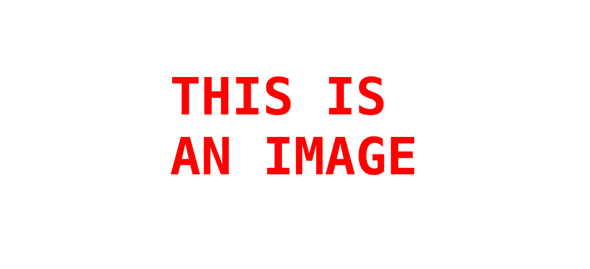

# Project title

This README serves as a template for the documentation of your project. You can use it as a guide to write your own documentation. At the end of the document you will find some information on the `project_template` repository.

Watch this video to better understand how to document your code with **Doxygen**:

[](https://youtu.be/VC7fExJJQSY?si=oIAZU_b2sRWhu3de "[MatrixMCU]. Documentación de código con Doxygen.")

## Authors

* **Author 1** - email: [author@author.es](mailto:author@author.es)
* **Author 2** - email: [author@author.es](mailto:author@author.es)

Write a brief descrition of your project **here**.

You can add a frontpage image **(ensure you are the owner)** here. e.g.: a picture of the HW setup, an oscilloscope capture, etc.

**Images must be located in folder `docs/assets/imgs/` and can be included in the document awith the following Markdown format:**

```markdown

```

It looks like this:


**Add a public link to video of your property with a demo and explanation of your project.**

To add a link to a Youtube video you can use the following Markdown format:

```markdown
[](https://youtu.be/VEDEO_ID "Hover text.")
```

It looks like this:

[](https://www.youtube.com/watch?v=CcbgLVfCXrw& "Youtube video.")

## Version 1

Brief description of version 1.

* To make a text bold, use the `**` symbol consecutively. For example: **Bold text**
* To make a text italic, use the `*` symbol consecutively. For example: *Italic text*
* To make a text both italic and bold, use the `***` symbol consecutively. For example: ***Italic and bold text***

To add subsections, use the `#` symbol consecutively. For example:

### Subsection 1

Brief description of subsection 1.

To add a list of items, use the `*` symbol consecutively. For example:

* Item 1
* Item 2
* Item 3

To add a list of numbered items, use the `1.` symbol consecutively. For example:

1. Item 1
2. Item 2
3. Item 3

To add a link to a webpage, use the following code:

```markdown
Link to [Google](https://www.google.com).
```

It looks like this: Link to [Google](https://www.google.com).

You can add tables in the following way:

| Column 1 | Column 2 | Column 3 |
| -------- | -------- | -------- |
| Value 1  | Value 2  | Value 3  |
| Value 4  | Value 5  | Value 6  |

To add a link to a `.c` or `.h` file, you can use the following code. You can add links to codes like this, with the simple use of the backtick symbol `:

```markdown
Link to the `interr.c`.
```

It looks like this: Link to the `interr.c`.

You can also change the name of the link, or point to another `.html` file. These are links to `.html` files that are automatically generated with the code documentation when running Doxygen and are located in the `docs/html/` folder.

```markdown
Link to the [FSM of Version 1](fsm__button_8c.html).
```

It looks like this: Link to the [File with ISRs](interr_8c.html).

## Version 2

Brief description of version 2.

## Version N

Brief description of version N.

## Information on project_template

Template repository for C projects

## File Organization

The application file organization is as follows:

| Main Folder Structure | Description                                                                                                   |
| --------------------- | ------------------------------------------------------------------------------------------------------------- |
| `.github/`            | Configuration files for GitHub actions on `devel` and `main` branches (to do).                                |
| `.vscode/`            | Configuration files for the Visual Studio Code IDE.                                                           |
| `bin/`                | Executables for the application and the tests.                                                                |
| `build/`              | CMake and make build files.                                                                                   |
| `common/`             | C source and header files of your project. These files must be platform-agnostic.                             |
| `port/`               | C source and header files of your project. These files are platform-specific.                                 |
| `main.c`              | The main routine of your project. It must contain a C `main` function from which your program starts running. |
| `test/`               | Test sources and required data for testing.                                                                   |
| `CMakeLists.txt`      | CMake lists file. It specifies how to create the `Makefile` of the application using the `cmake` tool.        |
